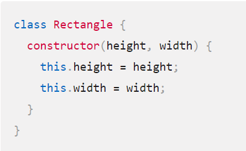
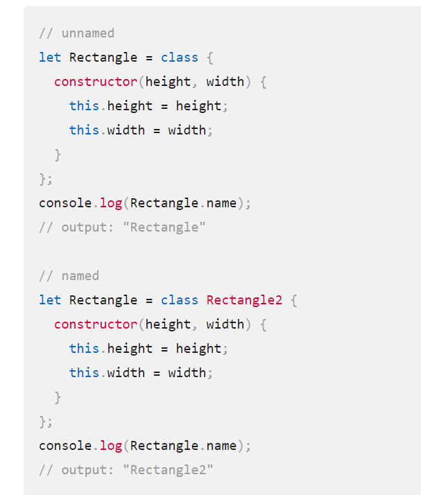
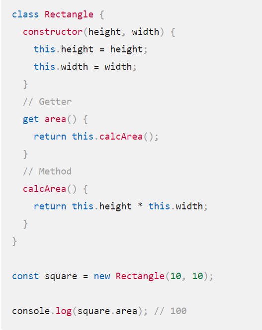

# Express REST API
# Review: ES6 Classes
### Classes are a template for creating objects.

## To Declare Class:
### use the class keyword with the name of the class ("Rectangle" here)

## And there is another way to define a class it is Class expressions.

## method definitions

---------------------------------------------------------

# Routing
### Routing refers to how an application’s endpoints (URIs) respond to client requests.
## Route methods:

### A route method is derived from one of the HTTP methods, and is attached to an instance of the express class.
- GET method
- POST(add)
- PUT(update)
- DELETE
## Route paths:
Route paths, in combination with a request method, define the endpoints at which requests can be made. Route paths can be strings, string patterns, or regular expressions.

## Route parameters:
### Route parameters are named URL segments that are used to capture the values specified at their position in the URL

# express.Router
It is a mini express application without all the bells and whistles of an express application, just the routing stuff.
### We can do with it :
- Use express.Router() multiple times to define groups of routes
- Apply the express.Router() to a section of our site using app use()

- Use route middleware to process requests.

- Use route middleware to validate parameters using .param().
- Use app.route() as a shortcut to the Router to define multiple requests on a route.

[Home Page](./README.md)

