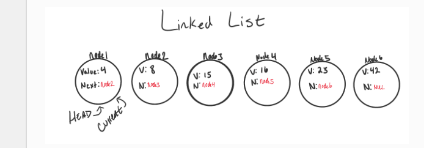

# Linked Lists

# Big O:
### notation is used to describe the efficiency of an algorithm or function. based on 2 factors:
- Running Time: The amount of time a function/algorithm needs to complete.

- Memory Space: How much space the function/algorithm needs to store its data and instructions.
### To find Big O() we should consider 4 Key:
- Input Size 
- Units of Measurement 
- Orders of Growth
- Best Case, Worst Case, and Average Case
## Big Omega: The best case analysis of algorithm efficiency.
## Big Theta: The typical or random case used for analysis of algorithm efficiency.
------------------------------------------------------------------

# Linked Lists
### is a sequence of Nodes that are connected/linked to each other. The most defining feature of a Linked List is that each Node references the next Node in the link.

##  Two types of Linked List:
- Singly: Singly refers to the number of references the node A has. A Singly linked list means that there is only one reference, and the reference points to the Next node in a linked list.
- Doubly: Doubly refers to there being two (double) references within the node. A Doubly linked list means that there is a reference to both the Next and Previous node.
## This is what a Singly Linked List looks like

# Notes:
### The best way to traverse through a linked list is by using (while()) loop.
### Traversing linked list has Big O of time = O(n) and Big O of space = O(1).
### Adding Nodes can be done in the begining of the linked list with Add() method and in the middle of it by AddBefor()or AddAfter() methods.
### Linked lists can be linear structured (traversed sequentially) and non-linear structured (traversed non-sequentially).
### Linked lists don't need to be continuous in memory(as arrays), they can grow dynamically.
### Parts of linked lists: Head(starting point) and the end of the list isn’t a node, but rather a node that points to null, or an empty value.
## Each single node must have two element:
- DATA: The information that the node contains.
- NEXT: reference to the next node.
## The main properties of a linked list data structure are:
- insertAt: Inserts an element at the specific index
- removeAt: Removes the element at the specific index.
- getAt: Retrieves the element at the specific index.
- clear: Empties the linked list.
- reverse: Reverses the order of elements in the linked list.

[Home Page](./README.md)

