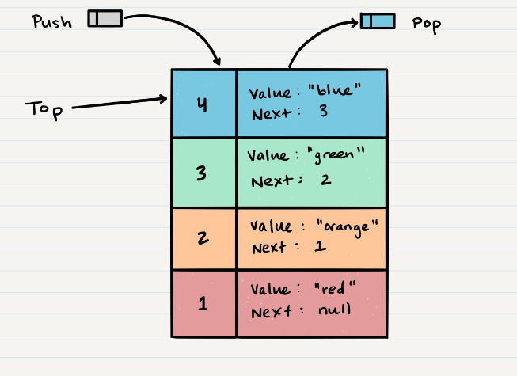

# Stacks and Queues
A stack is a data structure that consists of Nodes. Each Node references the next Node in the stack, but does not reference its previous.
## terminology for a stack :
- Push - Nodes or items that are put into the stack are pushed
- Pop - Nodes or items that are removed from the stack are popped. When you attempt to pop an empty stack an exception will be raised.
- Top - This is the top of the stack.
- Peek - When you peek you will view the value of the top Node in the stack. When you attempt to peek an empty stack an exception will be raised.
- IsEmpty - returns true when stack is empty otherwise returns false.

## we have two concepts stack is follow "
1. FILO
First In Last Out

This means that the first item added in the stack will be the last item popped out of the stack.

2. LIFO
Last In First Out

This means that the last item added to the stack will be the first item popped out of the stack.

stack Visualization"

----------------------------------------------------

# Queue :
- FIFO :First In First Out

- LILO : Last In Last Out

## Common terminology for a queue
1. Enqueue - Nodes or items that are added to the queue. O(1)
ALGORITHM enqueue(value)

node = new Node(value)

rear.next <-- node

rear <-- node

2. Dequeue - Nodes or items that are removed from the queue. O(1)
ALGORITHM dequeue()

Node temp <-- front

front <-- front.next

temp.next <-- null

return temp.value

//If called when the queue is empty >> exception will be raised.

3. Front - This is the front/first Node of the queue.

4. Rear - This is the rear/last Node of the queue.

5. Peek - When you peek you will view the value of the front Node in the queue. O(1)

ALGORITHM peek()

return front.value

//If called when the queue is empty >> exception will be raised.

6. IsEmpty - Returns true when queue is empty otherwise returns false. O(1)
ALGORITHM isEmpty()

return front = NULL

[Stacks and Queues](https://codefellows.github.io/common_curriculum/data_structures_and_algorithms/Code_401/class-10/resources/stacks_and_queues.html)

[Home page](./README.md)