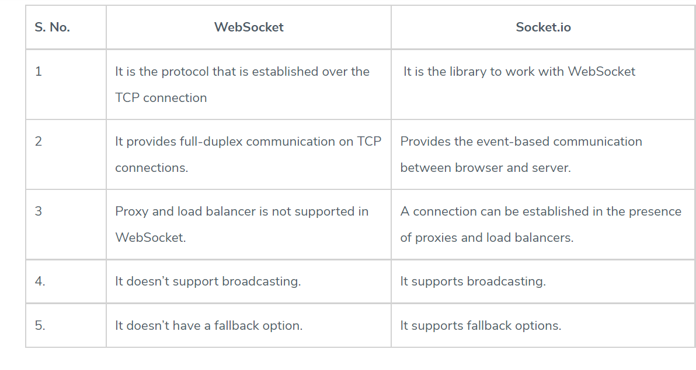

# SOCKET
## introduction :

WebSocket is a computer communications protocol, providing full-duplex communication channels over a single TCP connection, and it is distinct from HTTP.
The WebSocket protocol enables interaction between a web browser (or other client application) and a web server with lower overhead than half-duplex alternatives such as HTTP polling, facilitating real-time data transfer from and to the server.
A secure version of the WebSocket protocol is implemented in Firefox 6,[16] Safari 6, Google Chrome 14,[17] Opera 12.10 and Internet Explorer 10.[18] A detailed protocol test suite report[19] lists the conformance of those browsers to specific protocol aspects.
----------------------------------------------------------------------------------------------------------------
Socket.IO is built on top of the WebSockets API (Client side) and Node.js. It is one of the most depended upon library on npm (Node Package Manager).

### Difference Between WebSocket and Socket.io
WebSocket is the communication Protocol that provides bidirectional communication between the Client and the Server over a TCP connection; WebSocket remains open all the time, so they allow real-time data transfer. When clients trigger the request to the server, it does not close the connection on receiving the response; it rather persists and waits for the Client or server to terminate the request.
Socket.IO is a library that enables real-time and full-duplex communication between the Client and the Web servers. It uses the WebSocket protocol to provide the interface. Generally, it is divided into two parts; both WebSocket vs Socket.io are event-driven libraries.

Client-Side: it is the library that runs inside the browser
Server Side: It is the library for Node.js

### Why do we need Socket.IO?
- I handle all the degradation of your technical alternatives to get full-duplex communication in real-time.
- It also handles the various support level and the inconsistencies from the browser.
- It also gives the additional feature room support for basic publish infrastructure and thinks like automatic reconnect.
- Currently, AFAIK is the most used one and easier to help with vanilla web sockets.

### Socket.IO Tutorial
Socket.IO enables real-time bidirectional event-based communication. It works on every platform, browser or device, focusing equally on reliability and speed.

Sockets work based on events. These are some reserved events, which can be accessed using the socket object on the server-side:

* Connect
* Message
* Disconnect
* Reconnect
* Ping
* Join
* Leave
The client-side socket object also provides us with some reserved events:

* Connect
* Connect_error
* Connect_timeout
* Reconnect

### Logging & Debugging
Server-side
DEBUG=* node app.js

Client-side
localStorage.debug = '*'; To limit the output to get the debug info with incoming data from the socket: localStorage.debug = 'socket.io-client:socket';

References:

[WebSocket](https://en.wikipedia.org/wiki/WebSocket)

[Socket.IO Tutorial](https://www.tutorialspoint.com/socket.io/)

[Socket.io vs Web Sockets](https://www.educba.com/websocket-vs-socket-io/)

[OSI Model Explained](https://www.youtube.com/watch?v=vv4y_uOneC0)

[TCP Handshakes Explained](https://www.youtube.com/watch?v=xMtP5ZB3wSk)

[Home Page](./README.md)