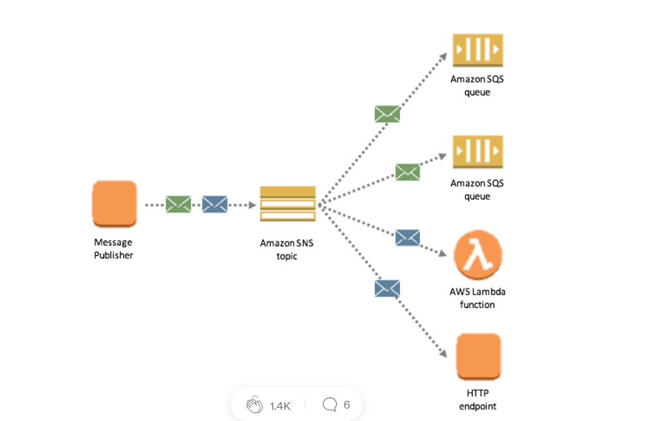

# AWS: Events
## SQS and SNS: 
- Amazon SNS (Simple Notification Service)
 is a fast, flexible, fully managed push notification service that lets you send individual messages or to bulk messages to large numbers of recipients. Amazon SNS makes it simple and cost effective to send push notifications to mobile device users, email recipients or even send messages to other distributed services.

SNS is a distributed publish-subscribe system. Messages are pushed to subscribers as and when they are sent by publishers to SNS.

SNS supports several end points such as email, sms, http end point and SQS. If you want unknown number and type of subscribers to receive messages, you need SNS.

- Amazon SQS (Simple Queue Service)
is a fully managed message queuing service that enables you to decouple and scale microservices, distributed systems, and serverless applications.

SQS is distributed queuing system. Messages are not pushed to receivers. Receivers have to poll SQS to receive messages. Messages can be stored in SQS for short duration of time (max 14 days).

Messages can’t be received by multiple receivers at the same time. Any one receiver can receive a message, process and delete it. Other receivers do not receive the same message later. Polling inherently introduces some latency in message delivery in SQS unlike SNS where messages are immediately pushed to subscribers.

Resource 

[AWS SQS vs SNS](https://medium.com/awesome-cloud/aws-difference-between-sqs-and-sns-61a397bf76c5)

[HomePage](README.md)

